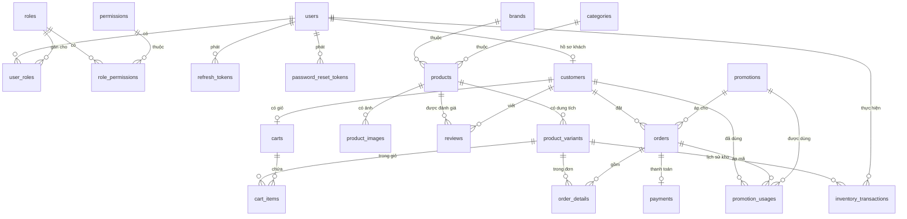

# ERD — Perfume Shop Management System

Sinh từ `backend/prisma/schema.prisma`. 23 model, 20 bảng nghiệp vụ + 3 bảng hạ tầng auth.

## Sơ đồ quan hệ

## Nhóm bảng

| Nhóm | Bảng |
|---|---|
| Danh tính & phân quyền | `users`, `roles`, `permissions`, `role_permissions`, `user_roles`, `refresh_tokens`, `password_reset_tokens` |
| Khách hàng | `customers` |
| Danh mục sản phẩm | `brands`, `categories`, `products`, `product_variants`, `product_images` |
| Kho | `inventory_transactions` |
| Giỏ hàng | `carts`, `cart_items` |
| Đơn hàng | `orders`, `order_details`, `payments` |
| Khuyến mãi | `promotions`, `promotion_usages` |
| Đánh giá | `reviews` |

## Quyết định thiết kế đáng lưu ý

**`users` ↔ `customers` là 1-1, không gộp một bảng.**
`users` giữ danh tính đăng nhập (email, mật khẩu, trạng thái) cho cả 3 role.
`customers` là hồ sơ nghiệp vụ chỉ dành cho role CUSTOMER (địa chỉ, tổng đơn, tổng chi tiêu).
Nhờ vậy chỉ có một nguồn xác thực duy nhất, và khóa khách hàng = đổi `users.status`.

**`products` không có giá, dung tích hay tồn kho.**
Ba thứ đó thuộc `product_variants` — mỗi dung tích là một variant với SKU riêng.
Đây là điểm phân biệt hệ thống quản lý shop nước hoa với một website bán hàng thường.
`price_range` và `total_stock` được tính từ variants khi trả API.

**`product_variants.stock_quantity` là nơi duy nhất lưu tồn kho hiện tại,
và `inventory_transactions` là lịch sử đầy đủ.**
Bất biến: `SUM(inventory_transactions.quantity)` theo variant **luôn bằng** `stock_quantity`.
Mỗi dòng lịch sử lưu cả `stock_before` và `stock_after` nên đối chiếu được từng bước,
không chỉ số cuối. Trong toàn bộ `backend/src` chỉ có **một** chỗ ghi vào `stock_quantity`
(`inventory.repository.applyStock`), nên bất biến này không thể bị phá vô tình.

**`order_details` snapshot giá và thông tin sản phẩm.**
Lưu `product_name`, `sku`, `volume_ml`, `unit_price` tại thời điểm đặt, không join lại
bảng sản phẩm khi đọc đơn. Đổi giá sản phẩm hôm nay không làm thay đổi đơn cũ.

**Soft delete cho `users`, `products`, `brands`, `categories`** qua `deleted_at`.
Dữ liệu nghiệp vụ đã tham chiếu (đơn hàng, lịch sử kho) không bị mất khi ẩn sản phẩm.

**`customers.total_orders` / `total_spending` là dữ liệu denormalized**, tính lại từ
đơn `COMPLETED` mỗi khi đơn vào hoặc rời trạng thái đó — nên không bao giờ lệch khỏi
dữ liệu đơn thật.

## Chỉ mục

Ngoài khóa chính và khóa ngoại:

| Bảng | Unique | Index |
|---|---|---|
| `users` | `email` | `status` |
| `roles` | `name` | |
| `permissions` | `code` | |
| `brands` / `categories` | `slug` | `status` |
| `products` | `slug` | `brand_id`, `category_id`, `status`, `gender` |
| `product_variants` | `sku`, `(product_id, volume_ml)` | `product_id`, `stock_quantity` |
| `inventory_transactions` | | `(variant_id, created_at)`, `type`, `created_by` |
| `cart_items` | `(cart_id, variant_id)` | `variant_id` |
| `orders` | `order_code` | `customer_id`, `(status, created_at)`, `promotion_id` |
| `promotions` | `code` | `(status, start_date, end_date)` |
| `promotion_usages` | `(promotion_id, order_id)` | `(promotion_id, customer_id)` |
| `reviews` | `(product_id, customer_id)` | `(product_id, is_hidden)` |

`reviews` unique theo `(product_id, customer_id)` là cách chặn đánh giá trùng ở tầng DB,
không chỉ ở tầng ứng dụng.

## Xem schema đầy đủ

- Prisma schema: [`backend/prisma/schema.prisma`](../backend/prisma/schema.prisma)
- SQL migration: `backend/prisma/migrations/`
- Xem trực quan: `cd backend && npx prisma studio`
